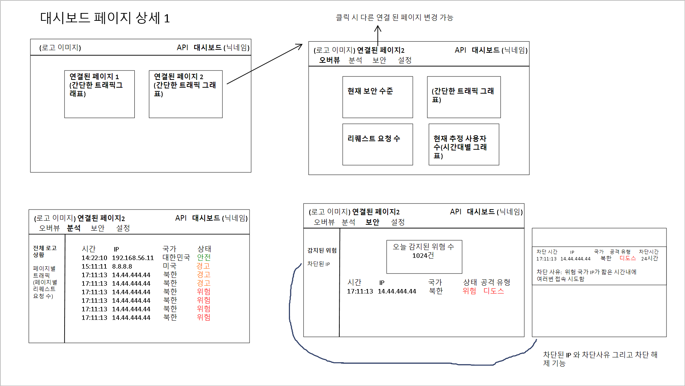
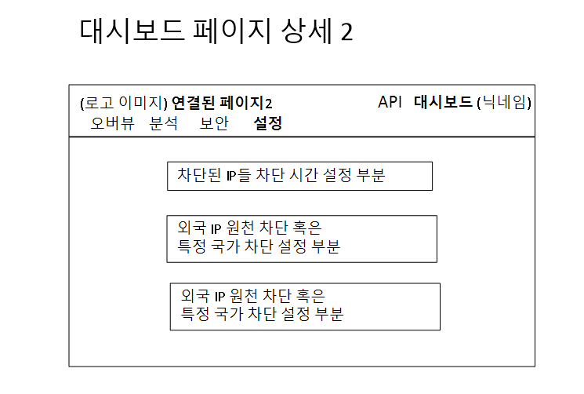

# 🛡️ AION(아이온)
> **AI 기반 네트워크 공격 감지 서비스 (NIDS)**

**AION**은 AI를 활용하여 사용자의 네트워크 트래픽 상태를 실시간으로 분석하고, 위협적인 공격을 감지하여 시각화해 주는 웹 기반 보안 플랫폼입니다.

> **[🛡️ 탐지 범위 (Detection Scope)]**
> * **💥 DDoS & Flooding:** `SYN Flood`, `UDP Flood`, `UDP Amplification`, `ICMP Flood`, `Other TCP Flood`
> * **🕵️ Reconnaissance (정찰):** `Port Scan` (포트 스캔)
> * **🐢 Slow-Rate Attack:** `Slowloris` (저속 공격)

 

[📺 AION 시연 영상 보러가기](hhttps://youtu.be/hAPD6JiZzeE)

 

## 👥 Developers (개발팀)

<table width="100%">
  <thead>
    <tr>
      <th width="33%" align="center">💻 웹 사이트 개발</th>
      <th width="34%" align="center">🧠 AI 분석 서버 개발</th>
      <th width="33%" align="center">🕵️ 분석기 개발 (Client)</th>
    </tr>
  </thead>
  <tbody>
    <tr>
      <td align="center">
        
      </td>
      <td align="center">
        
      </td>
      <td align="center">
        
      </td>
    </tr>
    <tr>
      <td align="center">
        <b>서승진</b>   
        
          웹 사이트 구현 
          로그인/회원가입 
          API 인증 
          API 별 데이터 관리 
          트래픽 통계 시각화 
          실시간 트래픽 요약 
          실시간 이메일 알림
        
      </td>
      <td align="center">
        <b>이준희</b>  
        👑 팀장  
        
          프로젝트 총괄 
          시스템 아키텍처 설계 
          JSON 포맷 정의 
           
          핵심 방법론 연구 
          (특징/트래픽 측정 방식) 
          학습 데이터셋 자체 구축 
          데이터 수집기 개발 
          AI 공격 탐지 모델 제작
        
      </td>
      <td align="center">
        <b>김윤정</b>   
        
          데이터 수집기 고도화 
          (분석기 제작) 
          트래픽 통계 실시간 확인 
          위험 IP 탐지 
          사용자 편의성 설정 
          분석기 패키징 
          매뉴얼 제작
        
      </td>
    </tr>
    <tr>
      <td align="center">
        
      </td>
      <td align="center">
        
      </td>
      <td align="center">
        
      </td>
    </tr>
  </tbody>
</table>

 

## 🏆 Awards
* **정보통신학과 공모전 장려상 수상**
 

## 🚀 Getting Started (시작 가이드)

### 🏠 1. 메인 사이트 접속
AION 서비스의 메인 랜딩 페이지입니다.

  

 

### 🔐 2. 회원가입 및 로그인
서비스 이용을 위해 계정을 생성하고 로그인합니다.

  

  

 

### 🔑 3. API 키 발급
분석기와 연동할 고유 API 키를 발급받습니다.

  

 

### 📥 4. 분석기 다운로드
내 PC를 보호할 분석기 프로그램과 매뉴얼을 다운로드합니다.

  

 

### 📖 5. 매뉴얼 확인
제공된 가이드를 참고하여 설정을 진행합니다.

  

 

### ▶️ 6. 탐지 시작
분석기를 실행하여 실시간 네트워크 보호를 시작합니다.

  

 

## 🚨 Core Features: 공격 탐지
### ⚠️ 공격 탐지 알림
분석기가 공격 패킷을 감지하면 즉시 화면에 경고 로고가 나타납니다. AION은 아래의 **7가지 주요 네트워크 공격**을 실시간으로 식별합니다.

  

 

### 📈 상태 대시보드
실시간 트래픽 흐름과 이상 징후를 그래프로 확인합니다.

  

 

### 📧 이메일 알림 
공격 발생 시 이메일로 알림을 전송하고

  

 

### 🚫 위험 IP 차단 정보
감지된 위험 IP 정보를 웹 서버로 전송하여 관리합니다.

  

 

## 💻 Web Dashboard Features (웹 기능)

### 🗄️ 키(Key)별 데이터 관리
생성한 API 키 별로 수집된 데이터를 분리하여 저장/관리합니다.

  

 

### 🎛️ 다양한 대시보드 위젯
사용자가 필요한 정보를 선택하여 볼 수 있는 다양한 메뉴를 제공합니다.

  

 

### ⚡ 실시간 트래픽 요약
현재 네트워크 트래픽 상태를 실시간 요약 정보로 제공합니다.

  

 

### 🧐 위협 분석 상세
등록된 위험 IP들의 상세 정보와 공격 이력을 제공합니다.

  

 

### 📑 다각도 트래픽 분석
수집된 데이터를 차트, 표 등 다양한 형식으로 가공하여 보여줍니다.

  

 

### ⚙️ 환경 설정
이메일 알림 수신 여부나 API 키 활성/비활성화 상태를 변경합니다.

  

 

## 🛠️ Development Process

### 1. Final System Architecture (최종 시스템 아키텍처)
> **"Secure Pipeline for Real-time Threat Detection"**
> 개발 완료 후 정립된 최종 시스템 구조입니다. 데이터의 수집부터 분석, 시각화까지 이어지는 파이프라인을 **보안성(Security)**과 **실시간성(Real-time)**에 초점을 맞춰 구현했습니다.

* **Secure Data Transmission:**
    * 사용자 분석기(AION_Sentinel)는 **5초 단위**로 플로우 통계 데이터를 집계하여 전송합니다.
    * 단순 전송이 아닌, **API Key와 Auth Key를 조합한 Hash 검증** 로직(Random Salt + Admin Value)을 통해 비인가된 접근을 원천 차단합니다.
* **Decoupled AI Engine:**
    * AI 분석 서버는 인증된 데이터의 **41개 핵심 피처**를 분석하여 공격 여부를 판별하고, 그 결과를 즉시 웹 서버와 DB로 전파합니다.
* **Centralized Data Management:**
    * 데이터베이스 서버는 사용자 정보, 트래픽 로그, 위험 IP 목록을 통합 관리하며 전체 시스템의 허브 역할을 수행합니다.

  
  
<em>[Figure 1] 간단한 아키텍처</em>

 

### 2. Initial Wireframe & Design (초기 기획 및 와이어프레임)
> **"Blueprint for the Dashboard"**
> 프로젝트 착수 단계에서 구상한 **초기 디자인(Prototype)**입니다. '판단'과 '대응'이 직관적으로 가능한 UI를 목표로 설계되었습니다.

개발 과정에서 실제 구현 가능성과 사용자 편의성을 고려하여 UI를 지속적으로 고도화하였으며, 아래의 초기 기획안을 바탕으로 현재의 대시보드가 완성되었습니다.

* **Concept:** 복잡한 설정 없이 API를 발급받고(Onboarding), 네트워크 흐름을 한눈에 보며(Monitoring), 위협에 대응(Response)하는 3단계 구성을 기획했습니다.
* **Plan:** * **Overview:** 텍스트보다는 그래프와 차트 위주의 시각화 배치

  <table>
    <tr>
      <td align="center"><b>초기 와이어 프레임: 페이지들</b></td>
    </tr>
    <tr>
      <td colspan="2" align="center"></td>
    </tr>
    <tr>
      <td colspan="2" align="center"><b>초기 와이어 프레임: 대시보드 1</b></td>
    </tr>
    <tr>
      <td colspan="2" align="center"></td>
    </tr>
        <tr>
      <td colspan="2" align="center"><b>초기 와이어 프레임: 대시보드 2</b></td>
    </tr>
    <tr>
      <td colspan="2" align="center"></td>
    </tr>
  </table>
  
<em>[Figure 2] 프로젝트 초기 와이어 프레임</em>

