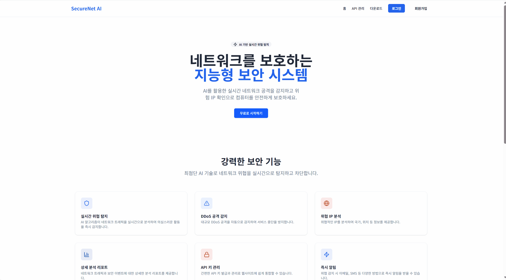
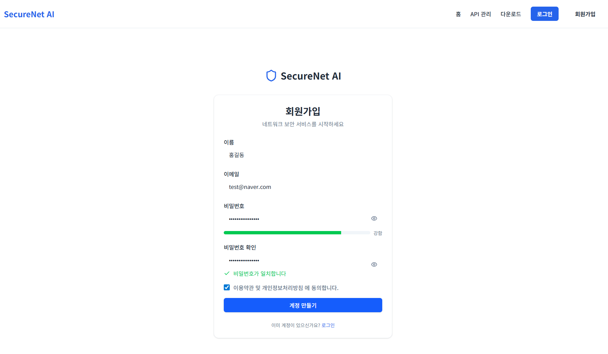
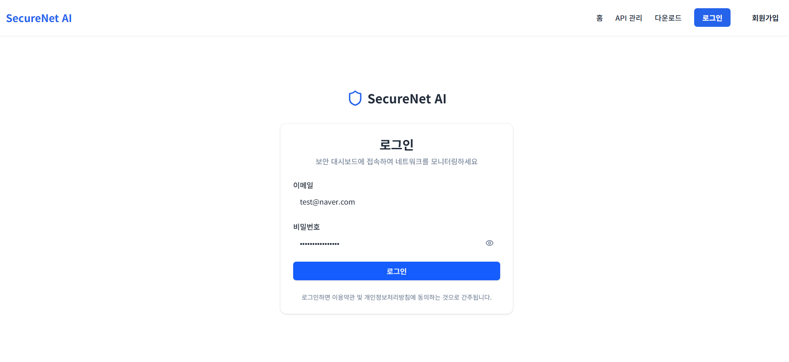
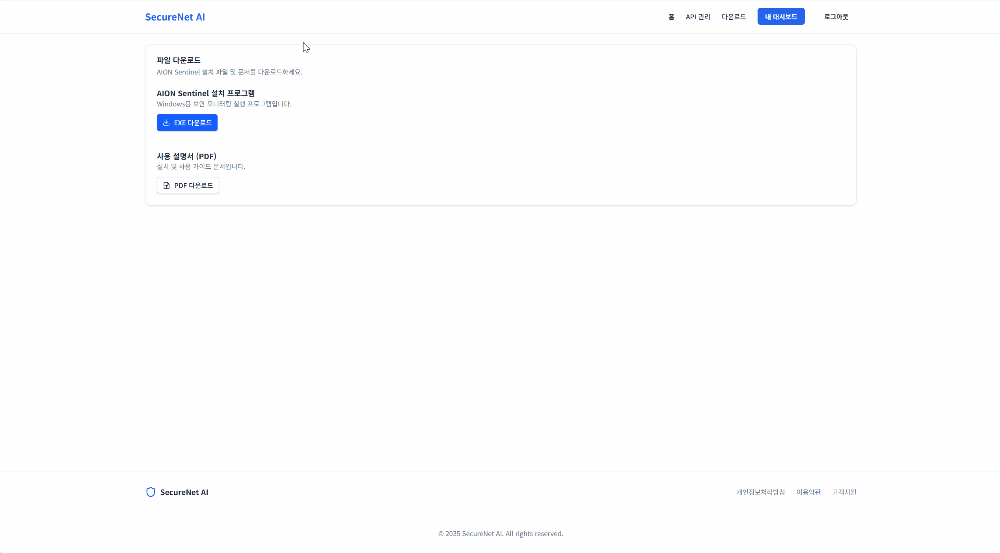
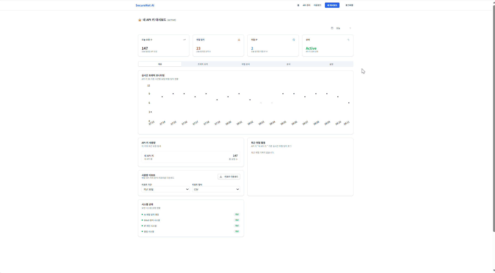
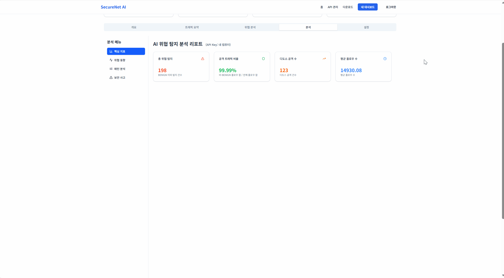
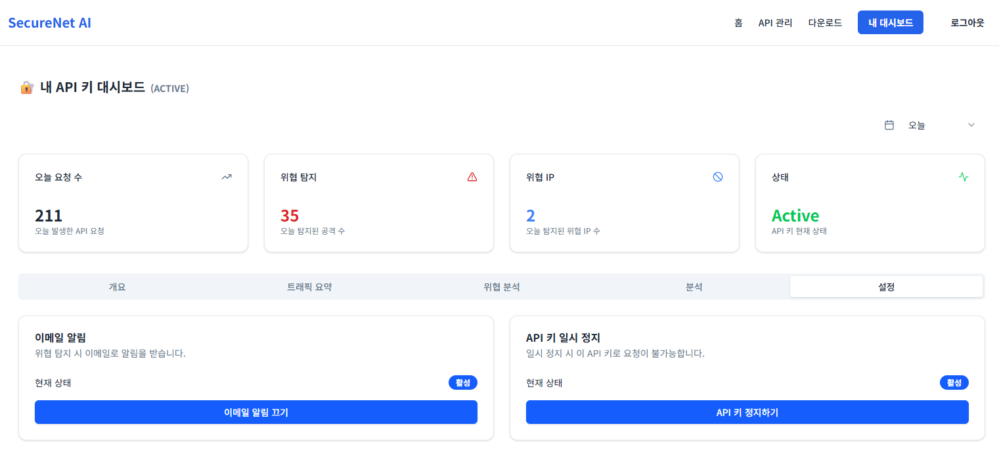
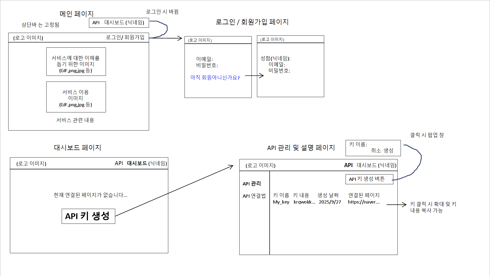
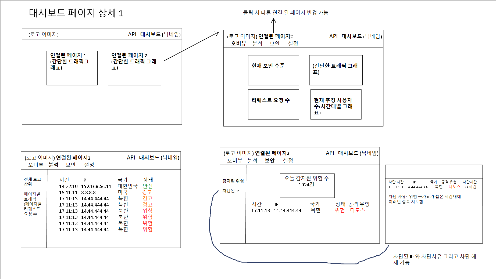
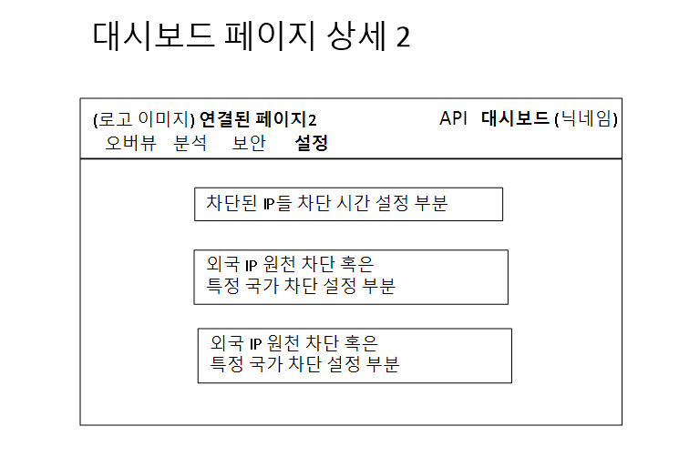

#  AION(아이온)
> **AI 기반 네트워크 공격 감지 서비스 (NIDS)**

**AION**은 AI를 활용하여 사용자의 네트워크 트래픽 상태를 실시간으로 분석하고, 위협적인 공격을 감지하여 시각화해 주는 웹 기반 보안 플랫폼입니다. 

> **[ 탐지 범위 (Detection Scope)]**
> * **💥 DDoS & Flooding:** `SYN Flood`, `UDP Flood`, `UDP Amplification`, `ICMP Flood`, `Other TCP Flood`
> * **🕵️ Reconnaissance (정찰):** `Port Scan` (포트 스캔)
> * **🐢 Slow-Rate Attack:** `Slowloris` (저속 공격)

<br/>

<div align="center">

[](https://www.youtube.com/watch?v=hAPD6JiZzeE)

[📺 AION 시연 영상 보러가기](https://www.youtube.com/watch?v=hAPD6JiZzeE)

</div>

<br/>

## 👥 Developers (개발팀)

<table width="100%">
  <thead>
    <tr>
      <th width="33%" align="center">💻 웹 사이트 개발</th>
      <th width="34%" align="center">🧠 AI 분석 서버 개발</th>
      <th width="33%" align="center">🕵️ 분석기 개발 (Client)</th>
    </tr>
  </thead>
  <tbody>
    <tr>
      <td align="center">
        <a href="https://github.com/seo342">
          
        </a>
      </td>
      <td align="center">
        <a href="https://github.com/Lineon24">
          
        </a>
      </td>
      <td align="center">
        <a href="https://github.com/Urban31722">
          
        </a>
      </td>
    </tr>
    <tr>
      <td align="center">
        <b>서승진</b> <br/><br/>
        <span style="font-size: 13px;">
          웹 사이트 구현<br/>
          로그인/회원가입<br/>
          API 인증<br/>
          API 별 데이터 관리<br/>
          트래픽 통계 시각화<br/>
          실시간 트래픽 요약<br/>
          실시간 이메일 알림
        </span>
      </td>
      <td align="center">
        <b>이준희</b> <br/>
        <span style="font-size: 12px;">👑 팀장</span><br/><br/>
        <span style="font-size: 13px;">
          프로젝트 총괄<br/>
          시스템 아키텍처 설계<br/>
          JSON 포맷 정의<br/>
          <br/>
          핵심 방법론 연구<br/>
          (특징/트래픽 측정 방식)<br/>
          학습 데이터셋 자체 구축<br/>
          데이터 수집기 개발<br/>
          AI 공격 탐지 모델 제작
        </span>
      </td>
      <td align="center">
        <b>김윤정</b> <br/><br/>
        <span style="font-size: 13px;">
          데이터 수집기 고도화<br/>
          (분석기 제작)<br/>
          트래픽 통계 실시간 확인<br/>
          위험 IP 탐지<br/>
          사용자 편의성 설정<br/>
          분석기 패키징<br/>
          매뉴얼 제작
        </span>
      </td>
    </tr>
    <tr>
      <td align="center">
        <a href="https://github.com/seo342/network-security-service">
          
        </a>
      </td>
      <td align="center">
        <a href="https://github.com/Lineon24/Network-ai-Analysis"> 
          
        </a>
      </td>
      <td align="center">
        <a href="https://github.com/Urban31722/network_analyzer">
          
        </a>
      </td>
    </tr>
  </tbody>
</table>

<br/>

## 🏆 Awards
* **U7 Makers 대회 안양대 총장상**
* **TEAM UP! 라이프톤 대상**
* **정보통신학과 공모전 장려상 수상**

<br/>

## 🚀 Getting Started (시작 가이드)

### 🏠 1. 메인 사이트 접속
AION 서비스의 메인 랜딩 페이지입니다.
<div align="center">
  
</div>
<br/>

### 🔐 2. 회원가입 및 로그인
서비스 이용을 위해 계정을 생성하고 로그인합니다.
<div align="center">
  
</div>
<div align="center">
  
</div>
<br/>

### 🔑 3. API 키 발급
분석기와 연동할 고유 API 키를 발급받습니다.
<div align="center">
  
</div>
<br/>

### 📥 4. 분석기 다운로드
내 PC를 보호할 분석기 프로그램과 매뉴얼을 다운로드합니다.
<div align="center">
  
</div>
<br/>

### 📖 5. 매뉴얼 확인
제공된 가이드를 참고하여 설정을 진행합니다.
<div align="center">
  
</div>
<br/>

### ▶️ 6. 탐지 시작
분석기를 실행하여 실시간 네트워크 보호를 시작합니다.
<div align="center">
  
</div>
<br/>

## 🚨 Core Features: 공격 탐지
### ⚠️ 공격 탐지 알림
분석기가 공격 패킷을 감지하면 즉시 화면에 경고 로고가 나타납니다. AION은 아래의 **7가지 주요 네트워크 공격**을 실시간으로 식별합니다.

<div align="center">
  
</div>
<br/>

### 📈 상태 대시보드
실시간 트래픽 흐름과 이상 징후를 그래프로 확인합니다.
<div align="center">
  
</div>
<br/>

### 📧 이메일 알림 
공격 발생 시 이메일로 알림을 전송하고
<div align="center">
  
</div>
<br/>

### 🚫 위험 IP 차단 정보
감지된 위험 IP 정보를 웹 서버로 전송하여 관리합니다.
<div align="center">
  
</div>
<br/>

## 💻 Web Dashboard Features (웹 기능)

### 🗄️ 키(Key)별 데이터 관리
생성한 API 키 별로 수집된 데이터를 분리하여 저장/관리합니다.
<div align="center">
  
</div>
<br/>

### 🎛️ 다양한 대시보드 위젯
사용자가 필요한 정보를 선택하여 볼 수 있는 다양한 메뉴를 제공합니다.
<div align="center">
  
</div>
<br/>

### ⚡ 실시간 트래픽 요약
현재 네트워크 트래픽 상태를 실시간 요약 정보로 제공합니다.
<div align="center">
  
</div>
<br/>

### 🧐 위협 분석 상세
등록된 위험 IP들의 상세 정보와 공격 이력을 제공합니다.
<div align="center">
  
</div>
<br/>

### 📑 다각도 트래픽 분석
수집된 데이터를 차트, 표 등 다양한 형식으로 가공하여 보여줍니다.
<div align="center">
  
</div>
<br/>

### ⚙️ 환경 설정
이메일 알림 수신 여부나 API 키 활성/비활성화 상태를 변경합니다.
<div align="center">
  
</div>
<br/>

## 🛠️ Development Process

### 개발 경험 — 이준희

공개 데이터셋으로 학습한 모델의 오탐에서 출발해 측정 방식과 데이터를 다시 설계하고, 팀과 함께 탐지·인증·시각화·사용성까지 확장한 과정입니다.

- **역할:** 3인 팀의 팀장, 프로젝트 총괄, 시스템 아키텍처·JSON 인터페이스·API 인증 알고리즘 설계, 데이터 수집기·데이터셋·AI 모델·분석 서버 개발
- **주요 기술:** Python, FastAPI, Uvicorn, XGBoost, Pandas, Supabase, HTTP/JSON
- **구현 저장소:** [AI 분석 서버](https://github.com/Lineon24/Network-ai-Analysis)

#### 역할과 협업

저는 트래픽을 어떤 단위로 측정할지 정하고, 수집한 데이터를 모델과 분석 서버로 연결했습니다. 분석기·AI 분석 서버·웹 서버·DB의 책임을 나누고 JSON 요청·응답 포맷을 정의했으며, 초기 웹 와이어프레임과 API 인증 구조를 설계했습니다.

웹사이트의 API 인증·데이터 관리·시각화는 서승진이, 분석기 고도화·위험 IP 탐지·GUI·매뉴얼은 김윤정이 담당했습니다. 아래 서비스 기능 확장은 팀의 성과이며, 개인 기여는 측정·모델·분석 서버 개발과 구조 설계·연동·총괄을 중심으로 설명합니다.

#### 1. 반복되는 오탐을 측정 방식부터 다시 살펴보다

초기에는 CIC-DDoS 2019, CSE-CIC-IDS 2018, CIC-IDS 2017을 활용해 공격 탐지 모델을 만들었습니다. 하지만 정상 트래픽을 DDoS로 판단하는 오류가 반복됐고, 입력 특징을 제거·추가하거나 전처리를 바꿔도 문제가 지속됐습니다.

모델 설정만 조정하는 대신 보안 도메인을 조사했습니다. DDoS에서는 개별 요청의 형태뿐 아니라 일정 시간 동안의 요청량과 집중 양상이 중요하다고 보고, AION의 입력을 **5초 단위 트래픽 통계**로 재설계했습니다.

| 관찰하려는 현상 | 측정에 반영한 항목 |
| --- | --- |
| 트래픽의 양과 집중 | 플로우·패킷·바이트 수 |
| 프로토콜별 트래픽 구성 | TCP·UDP·ICMP 비율, SYN 비율 |
| 증폭 공격과 관련된 요청 | 관련 포트 요청량 |
| 후속 확장: 긴 연결 유지 | 연결 지속 시간 관련 특징 |
| 후속 확장: 여러 포트 접근 | IP·포트 다양성 관련 특징 |

새 측정 방식과 기존 데이터셋의 입력이 그대로 일치하지 않아, 직접 관리하는 컴퓨터·가상 환경에서 정상·공격 트래픽을 발생시키고 자체 수집기로 데이터를 구축했습니다. 학습 데이터와 서비스 입력이 같은 정의의 특징을 사용하도록 맞추는 것이 핵심이었습니다.

이 선택은 공개 데이터셋이나 플로우 기반 탐지가 일반적으로 부적합하다는 뜻은 아닙니다. 당시 AION에서 겪은 입력 환경의 차이와 목표 공격을 다루기 위한 설계 판단입니다.

팀은 자체 데이터 기반 DDoS 모델을 분석기·분석 서버·초기 웹의 트래픽 요약과 보안보고서에 연결했고, 이 버전으로 **정보통신학과 공모전 장려상**을 받았습니다.

#### 2. 공격 유형을 확장하고 오분류를 데이터 생성 과정까지 추적하다

다음 단계에서는 Slowloris의 긴 연결 지속성과 Port Scan의 다중 포트 접근을 표현하도록 특징과 데이터를 추가했습니다. 수집기에서 새 특징을 측정하고, 모델을 학습한 뒤 분석 서버와 분석기가 같은 입력을 사용하도록 연동했습니다. 최종 모델은 **41개 특징으로 정상과 7개 공격 유형**을 분류합니다.

높은 전체 정확도에서도 남은 오분류를 개별적으로 확인했습니다. 수집 환경을 추적하면서 피해자 측 응답·반사 트래픽이 공격 데이터에 섞여 판단에 영향을 주는 것을 발견했습니다. 공격이 발생한 시간에 수집됐다는 이유만으로 모든 관측값이 공격 행위 자체를 나타내는 것은 아니었습니다.

최종 과제수행결과보고서에는 반사 데이터 약 300개를 정상 데이터로 추가하고 일부 노이즈를 제거한 과정이 기록돼 있습니다.

| 평가 기록 | 테스트 표본 수 | 결과 |
| --- | ---: | --- |
| 보고서 1차 평가 | 6,041 | 2개 오분류, 정확도 99.97% |
| 정제 후 최종 평가 | 6,095 | 정확도 100%, 클래스별 Precision·Recall·F1-score 1.00 |

이는 **자체 구축한 테스트셋의 평가 결과**입니다. 평가 데이터 구성이 달라 동일 조건의 성능 향상률로 계산하지 않으며, 실제 운영 환경에서 오탐이 없다는 뜻도 아닙니다. 다른 수집 시점·환경의 트래픽과 학습·평가 데이터의 독립성은 추가 검증 과제입니다.

#### 3. 모델을 인증과 결과 전달이 있는 서비스로 연결하다

FastAPI 분석 서버에서는 키 검증, 모델 입력 정리, XGBoost 추론, 결과 전송을 연결했습니다.

```text
분석기: 5초 통계 특징 전송
  → POST /predict: API 키·인증 키 검증
  → 고정된 41개 특징 순서로 입력 정리
  → 결측값·무한값 처리
  → XGBoost 공격 유형 분류
  → 예측 라벨·클래스별 점수·판정 참고값 구성
  ├─ 웹 서버에 JSON 전달
  └─ 요청한 분석기에 JSON 응답
```

**인증 구조:** 사용자별 난수와 서버 비밀값으로 해시 기반 키를 검증하고, DB의 키 활성 상태를 확인하도록 설계했습니다. 웹에서 발급한 키를 분석기에 등록하면 서버 검증으로 이어집니다. 이는 키를 가진 클라이언트의 요청 인증이며, PC 하드웨어에 키를 귀속시키는 기능은 아닙니다. 기록된 서버 코드에는 DB 초기화 실패 시 개발용 인증값을 반환하는 분기가 남아 있어 운영 전 보완이 필요합니다.

**입력과 결과의 일치:** 분석기에서 전달한 값을 모델이 기대하는 열 순서와 형식에 맞추고, 모델 결과를 웹과 분석기가 사용할 JSON으로 구성했습니다. 주요 입력값도 판정 참고값으로 전달했으며, 이는 별도의 인과 설명 모델을 구현한 것은 아닙니다.

**외부 전송 오류 처리:** 웹 서버 전송에는 타임아웃과 예외 로그를 두고, 전송 예외가 발생해도 분석기에는 추론 결과를 반환하는 흐름을 구현했습니다. 웹 저장을 보장하는 전송 큐나 자동 재전송까지 구현한 것은 아닙니다.

팀은 여기에 웹의 API 키 관리·위험 IP 목록과 위치 조회·통계 시각화, 분석기의 상세 모니터링·GUI를 연결했습니다. 분석기의 임계치 기반 위험 IP 후보 식별과 모델의 공격 유형 분류는 구분되는 기능입니다. 이 고도화 버전으로 **TEAM UP! 라이프톤 대상**을 받았습니다.

#### 4. 사용자 10명의 피드백으로 설명과 화면을 개선하다

TEAM UP! 이후 전공자·비전공자 총 10명에게 서비스를 사용하게 하고 설문과 피드백을 받았습니다. 탐지 기능이 동작하더라도 사용자가 용어와 화면의 상태를 이해하기 어렵다면 서비스 이용에 한계가 있었습니다.

피드백을 바탕으로 팀은 설명서와 용어 안내를 보완하고 웹·분석기 화면의 가시성을 개선했습니다. 저는 피드백을 팀의 개선 과제로 연결하고 전체 사용 흐름을 조율했습니다. 이 버전으로 **U7 Makers 대회 안양대 총장상**을 받았습니다.

위 순서는 실제 개발·출품 순서입니다. TEAM UP! 상장은 대회 이후 발급돼 상장 날짜순과 개발 순서가 다릅니다.

#### 이 경험에서 배운 점

- **모델 이전에 관측을 점검하기:** 반복되는 오류의 원인을 특징·전처리뿐 아니라 측정 단위와 데이터 수집 환경까지 확장해 살펴봤습니다.
- **높은 평균 점수에서도 실패 사례 추적하기:** 오분류가 만들어진 조건과 라벨의 의미를 확인하면서 데이터 품질을 개선했습니다.
- **구성 요소 사이의 의미 맞추기:** 수집기·모델·서버·화면이 같은 특징과 결과를 해석하도록 인터페이스와 책임을 정했습니다.
- **사용자의 이해까지 개발 범위에 포함하기:** 기능 구현 이후에도 실제 피드백을 받아 설명과 화면을 개선했습니다.

#### 관련 기록

- [개인 경험 원문과 평가·구현 상세](https://github.com/Lineon24/profile/blob/main/experiences/01-aion-nids.md)
- [최종 보고서·발표자료 안내](https://github.com/Lineon24/profile/tree/main/experiences/materials/aion)
- [수상 증빙](https://github.com/Lineon24/profile/tree/main/experiences/awards/aion)

### 1. Final System Architecture (최종 시스템 아키텍처)
> **"Secure Pipeline for Real-time Threat Detection"**
> 개발 완료 후 정립된 최종 시스템 구조입니다. 데이터의 수집부터 분석, 시각화까지 이어지는 파이프라인을 **보안성(Security)**과 **실시간성(Real-time)**에 초점을 맞춰 구현했습니다.

* **Secure Data Transmission:**
    * 사용자 분석기(AION_Sentinel)는 **5초 단위**로 플로우 통계 데이터를 집계하여 전송합니다.
    * 단순 전송이 아닌, **API Key와 Auth Key를 조합한 Hash 검증** 로직(Random Salt + Admin Value)을 통해 비인가된 접근을 원천 차단합니다.
* **Decoupled AI Engine:**
    * AI 분석 서버는 인증된 데이터의 **41개 핵심 피처**를 분석하여 공격 여부를 판별하고, 그 결과를 즉시 웹 서버와 DB로 전파합니다.
* **Centralized Data Management:**
    * 데이터베이스 서버는 사용자 정보, 트래픽 로그, 위험 IP 목록을 통합 관리하며 전체 시스템의 허브 역할을 수행합니다.

<div align="center">
  
  <p><em>[Figure 1] 간단한 아키텍처</em></p>
</div>

<br>

### 2. Initial Wireframe & Design (초기 기획 및 와이어프레임)
> **"Blueprint for the Dashboard"**
> 프로젝트 착수 단계에서 구상한 **초기 디자인(Prototype)**입니다. '판단'과 '대응'이 직관적으로 가능한 UI를 목표로 설계되었습니다.

개발 과정에서 실제 구현 가능성과 사용자 편의성을 고려하여 UI를 지속적으로 고도화하였으며, 아래의 초기 기획안을 바탕으로 현재의 대시보드가 완성되었습니다.

* **Concept:** 복잡한 설정 없이 API를 발급받고(Onboarding), 네트워크 흐름을 한눈에 보며(Monitoring), 위협에 대응(Response)하는 3단계 구성을 기획했습니다.
* **Plan:** * **Overview:** 텍스트보다는 그래프와 차트 위주의 시각화 배치

<div align="center">
  <table>
    <tr>
      <td align="center"><b>초기 와이어 프레임: 페이지들</b></td>
    </tr>
    <tr>
      <td colspan="2" align="center"></td>
    </tr>
    <tr>
      <td colspan="2" align="center"><b>초기 와이어 프레임: 대시보드 1</b></td>
    </tr>
    <tr>
      <td colspan="2" align="center"></td>
    </tr>
        <tr>
      <td colspan="2" align="center"><b>초기 와이어 프레임: 대시보드 2</b></td>
    </tr>
    <tr>
      <td colspan="2" align="center"></td>
    </tr>
  </table>
  <p><em>[Figure 2] 프로젝트 초기 와이어 프레임</em></p>
</div>

